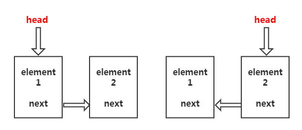

## 什么是链表(LinkedList)?
链表实际上是线性表的链式存储结构。

### 一.单向链表

各个节点数据通过指针的方法串联起来,构成链表。（单向指针）


实现单向链表

```js
class Node {
    constructor(element, next) {
        this.element = element;
        this.next = next;
    }
}
/**
 * add(index,element)  指定索引添加元素 
 * add(element)  直接添加元素
 * get(index)  获取指定索引元素
 * set(index,element) 修改指定索引节点内容
 * remove(index) 删除指定索引节点
 * clear() 清空链表 
 * 
 */
class LinkedList {
    constructor() {
        this.size = 0;
        this.head = null;
    }
    _node(index) {
        if (index < 0 || index >= this.size) throw new Error('越界');
        let current = this.head;
        for (let i = 0; i < index; i++) {
            current = current.next;
        }
        return current;
    }
    add(index, element) {
        if (arguments.length === 1) {
            element = index;
            index = this.size;
        }
        if (index < 0 || index > this.size) throw new Error('越界');
        if (index === 0) {
            let head = this.head;
            this.head = new Node(element, head);
        } else {
            let prevNode = this._node(index - 1);
            prevNode.next = new Node(element, prevNode.next);
        }
        this.size++;
    }
    get(index) {
        return this._node(index);
    }
    set(index, element) {
        let node = this._node(index);
        node.element = element;
        return node;
    }
    remove(index) {
        if (index < 0 || index >= this.size) throw new Error('越界');
        if (index === 0) {
            this.head = this.head.next;
        }else{
            let prevNode = this._node(index - 1);
            prevNode.next = prevNode.next.next;
        }
        this.size --;
    }
    clear() {
        this.size = 0;
        this.head = null;
    }
}
```

### 二.链表的反转

(1)递归实现



```js
reverseList(){
    function reverse(head){
        if(head == null || head.next == null) return head;
        let newHead = reverse(head.next);
        head.next.next = head;
        head.next = null;
        return newHead;
    }
    this.head = reverse(this.head);
    return this.head 
}


```