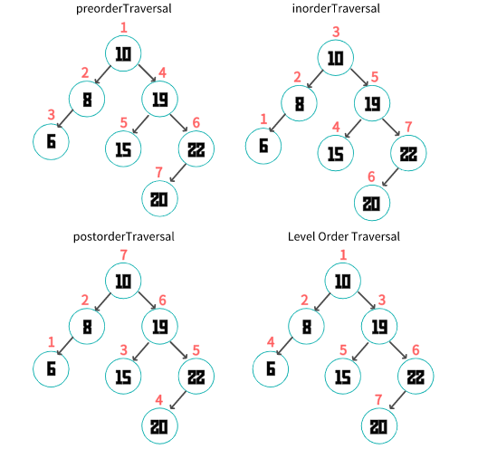

## 树
### 一.树形结构

像数组、栈、队列、默认都是线性结构类型。常见的树形结构有二叉树和多叉树（大于两个叉的树）。

开发中常见的树形结构有: **文件夹目录**、**DOM结构**、**路由的配置**...... （树的数据结构是非常重要的）

常见概念

- 节点 （根节点、父节点、子节点、兄弟节点）

- 子树 （左子树、右子树）,子树的个数称之为度

- 叶子节点 （度为0的节点） 非叶子节点 （度不为0的节点）

- 节点的深度 （从根节点到当前节点所经过的节点总数）

- 节点的高度 （从当前节点到最远叶子节点经过的节点总数）

- 树的层数 （树的高度、树的深度）

- 有序树( 节点按照顺序排列）、无序树

### 二.二叉树

二叉树是每个结点最多有两个子树的树结构 ，每个节点的度最多为2。 通常子树被称作“左子树”（left subtree）和“右子树”（right subtree） ，左子树和右子树是有顺序的

#### 二叉树的常见概念

- 真二叉树： 不含一度节点的二叉树称作真二叉树(proper binary tree)
- 满二叉树：满二叉树也是真二叉树，且所有的叶子节点都在最后一层
- 完全二叉树： 深度为k的有n个结点的二叉树，对树中的结点按从上至下、从左到右的顺序进行编号，如果编号为i（1≤i≤n）的结点与满二叉树中编号为i的结点在二叉树中的位置相同，则这棵二叉树称为完全二叉树。

###  三.二叉树的遍历

线性数据结构遍历比较简单可以采用正序遍历、逆序遍历

#### 1.二叉树的遍历方式

常见的二叉树遍历的四种方式

- 前序遍历Preorder Traversal(先访问根节点、前序遍历左子树、前序遍历右子树)

- 中序遍历 Inorder Traversal(中序遍历左子树、根节点、中序遍历右子树)

- 后续遍历 Postorder Traversal(后序遍历左子树、后续遍历右子树、根节点)

- 层序遍历 Level Order Traversal (从上到下，从左到右依次访问每一个节点)



#### 2.前序遍历

```js
preorderTraversal() {
	const traversal = (node) => {
	if (node === null) return
        console.log(node.element); // 先访问根节点
        traversal(node.left); // 在访问左子树
        traversal(node.right);// 在访问右子树
    }
    traversal(this.root);
} 
```

#### 3.中序遍历

```js

inorderTraversal() {
    const traversal = (node) => {
        if (node === null) return
        traversal(node.left);
        console.log(node.element);
        traversal(node.right);
    }
    traversal(this.root);
}
```
对于二叉搜索树来说，中序遍历默认从小到大或者从大到小。

#### 4.后续遍历

```js

postorderTraversal() {
    const traversal = (node) => {
    if (node === null) return
        traversal(node.left);
        traversal(node.right);
        console.log(node.element);
    }
 traversal(this.root);
}
```
#### 5.层序遍历

```js
levelOrderTraversal() {
    if (this.root == null) return;
    let stack = [this.root];
    let currentNode = null;
    let index = 0;
    while (currentNode = stack[index++]) {
        console.log(currentNode.element); 
        if (currentNode.left) {
            stack.push(currentNode.left);
        }
        if (currentNode.right) {
            stack.push(currentNode.right);
        }
    }
}

```


