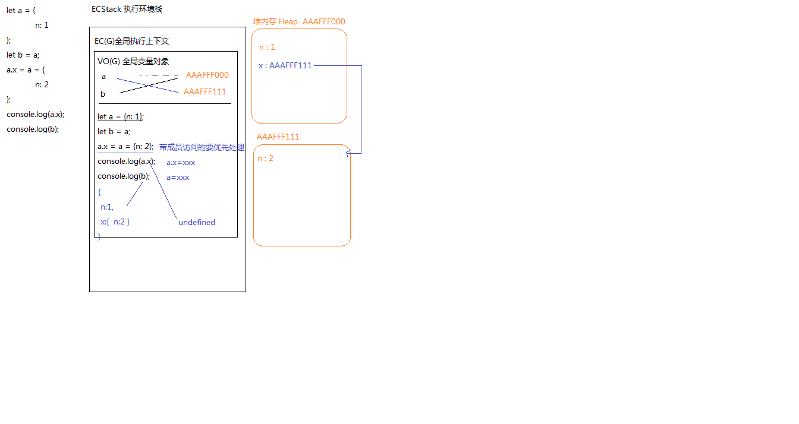
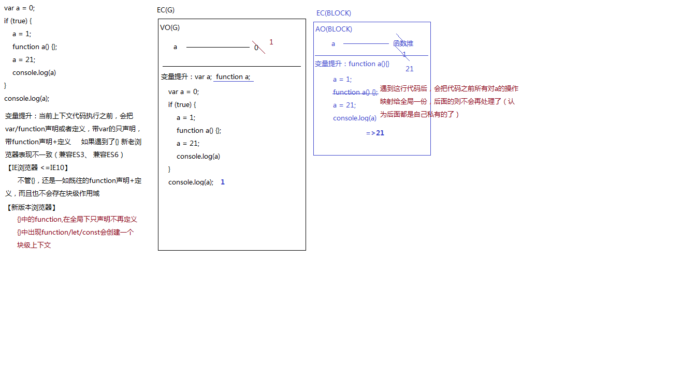
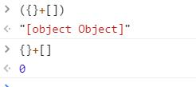

## 类型转换相关题目
###  第一题：
```js
let result = 100 + true + 21.2 + null + undefined + "Tencent" + [] + null + 9 + false;
console.log(result);  //NaNTencentnull9false
console.log([]==false); // true
console.log(![]==false); //true
```

```js
 let num =100 + NaN;
 console.log(num) //NaN

```
题目解析：

```js
true转换成数字是1
null转换成数字是0
undefined 转换成数字是NaN
100 + true + 21.2 + null + undefined 为：100+1+21.2+0+NaN = 122.2+NaN = NaN
[]转换成字符串是""
所以NaN+"Tencent" + "" + null + 9 + false为：NaNTencentnull9false
```

```js
[]==false
根据==比较规则，等号两边的类型不一致时，[]先转换成字符串""，再转换成数字0，
false转换成数字是0
```
```js
![]==false
![]先转换成布尔值再取反，[]转换成布尔值是true,取反是false
考点：只有 ‘0、NaN、null、undefined、空字符串’ 五个值会变 为布尔的FALSE，其余都是TRUE
```

扩展：

```js
[]+{}
 解析：[].toString()等于"",
 {}.toString()等于"[object Object]",""+"[object Object]"="[object Object]"
```

```js
{}+[]
  解析：{}+[]相当于{}; +[],此处的{}会被当作一个代码快处理，+[]是类型转换，
  js中+和-开头的变量都会被转换成Number类型，不是Number的会被转换成NaN,
  +[]转换成Number类型的时候，[]先转换成字符串，[].toString()是"",空字符串转换成数字是0

```

注意：只要不在一个语句的头部检测到{} 或者{}这种形式，那么它就不是一个代码块。  扩展 ({}+[])

```js
!+[]=true
  解析:同上+[]是0，!可以把变量转换成布尔类型，所以!0就是true
```
### 第二题：

```js
var a = ?;
if (a == 1 && a == 2 && a == 3) {
    console.log(1);
}
```
答案解析：

```js
可以根据对象转换成数字需要转换成字符串再转换成数字，
需要调用valueOf(),再调用toString(),则可以拦截对象自身的toString()方法
（1）  var a = {
        i:0,
        toString(){
          return  ++this.i;
        }
   };
  if (a == 1 && a == 2 && a == 3) {
    console.log(1);
}
或者
（2）
  var i = 0;
   Object.defineProperty(window,'a',{
       get(){
           return ++i;
       }
   })
```

### 第三题：

```js
let arr = [10.18, 0, 10, 25, 23];
arr = arr.map(parseInt);
console.log(arr);  //[10, NaN, 2, 2, 11]
```
解题思路：

```js
如下例子：
  arr = arr.map((item, index) => {
      return item *10
 })
 map函数的作用就是改变数组的每一项然后返回一个新数组
 parseInt(10.18,0)
 =>10
 parseInt(0,1)
 =>NaN
 parseInt(10,2)
 => 2
 parseInt(25,3)
 =>2*3^0=2
 parseInt(23,4)
 =>2*4+3*4^0 =11
```
扩展：
```js
parseInt('0x88') //136
parseInt(0x88) //136
parseInt(011) //9
parseInt('011') //11
```
### 第四题：

```js
let a = {n: 1};
let b = a;
a.x = a = {n: 2};
console.log(a.x);
console.log(b);
```
解题思路：

```js
先在堆内存创建值n:1,再创建变量a,从栈中读取内存地址，然后再根据地址找到保存在堆内存中的值；
let b=a;使b指向a,两个变量实际上将引用同一个对象；因此改变其中的一个，将影响另一个；
a.x 带成员访问的优先处理 a.x 指向{n:2}
a 指向{n:2}
因此此时 a为{n:2}
b为{
    n: 1
    x: {n: 2}
   }
a.x为undefined   
```


```js
 let a = b =10;
 (function(){
   let a = b = 20;
 })()
 console.log(a)
 console.log(b)
 //10 20
 解析：let a=10; b=10;
    (function(){
      let a = 20;
         b = 20;
 })()
```

### 第五题：

```js
debugger;
var a = 0;
if (true) {
   a = 1;
  function a() {};
    a = 21;
    console.log(a)
}
console.log(a);
//21  1

```

```js

变量提升：
当前上下文代码执行之前，会把var/function声明或者定义，带var的声明，带function声明+定义 
如果遇到了{}新老浏览器表现不一致（兼容ES3、兼容es6）

老版本ie<=10浏览器：
不会理会{}，不会存在块级作用域
var a;
function a() {};
a = 0;
if (true) {
    a = 1;
    a = 21;
    console.log(a)
}
console.log(a);
//21 21

新版本浏览器
{}中的function在全局只声明，不再定义即：var a;function a;
{}中出现的function/let/const会创建一个块级上下文
debugger;
var a;function a;
a= 0
if (true) {
    function a() {};
    a = 1;
   //  function a() {};  
    遇到这行代码后，会把代码之前所有对a的操作，隐射给全局一份，后面的则不会再处理了（认为后面都是私有的了）
    a = 21;
     console.log(a)
}
console.log(a);
```



{}+[]是因为{}会被当作代码块，+，-开头的变量会被转换成number，所以+[]是0

只要不在一个语句的头部检测到{} 或者 ;{}这种形式，那么它就不是一个代码块。


