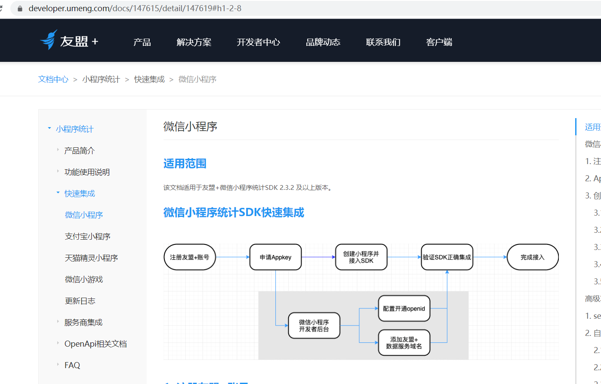

## 小程序友盟事件埋点

### 进入友盟小程序埋点模块


其他上面写的很明细可以跟着做，需要注意的是小程序里面如何使用npm和添加自定义事件

### 创建微信小程序并接入SDK

1.在小程序根目录内，生成依赖配置文件package.json

```bash
npm init 
```
2、在小程序 package.json 所在的目录中执行命令安装 npm 包：
```bash
npm install umtrack-wx  --save
```
3、点击开发者工具中的菜单栏：工具 --> 构建 npm


4、勾选“使用 npm 模块”选项：


5、使用 npm 包

```js
import 'umtrack-wx';
App({
  umengConfig: {
    appKey: 'YOUR_UMENG_APPKEY', //由友盟分配的APP_KEY
    // 使用Openid进行统计，此项为false时将使用友盟+uuid进行用户统计。
    // 使用Openid来统计微信小程序的用户，会使统计的指标更为准确，对系统准确性要求高的应用推荐使用Openid。
    useOpenid: true,
    // 使用openid进行统计时，是否授权友盟自动获取Openid，
    // 如若需要，请到友盟后台"设置管理-应用信息"(https://mp.umeng.com/setting/appset)中设置appId及secret
    autoGetOpenid: false,
    debug: false, //是否打开调试模式
    uploadUserInfo: true // 自动上传用户信息，设为false取消上传，默认为false
  },

```

### 自定义事件添加流程

1、进入U-MiniProgram后台 ->统计分析 ->“自定义事件”页面，点击“事件管理”；
添加埋点事件的页面https://databank.umeng.com/sdc/manage


2、点击“添加事件”，输入小程序埋点的事件ID和名称（确保你的event id 和你的小程序页面的事件id一致）


3、添加之后的效果


4、使用


5、返回小程序自定义事件页面查看该事件数据，在这里可以看到你自定义事件触发的次数
https://mp.umeng.com/analysis/5eb3a6c3dbc2ec0856ab3236/conversion/custom-event


## 