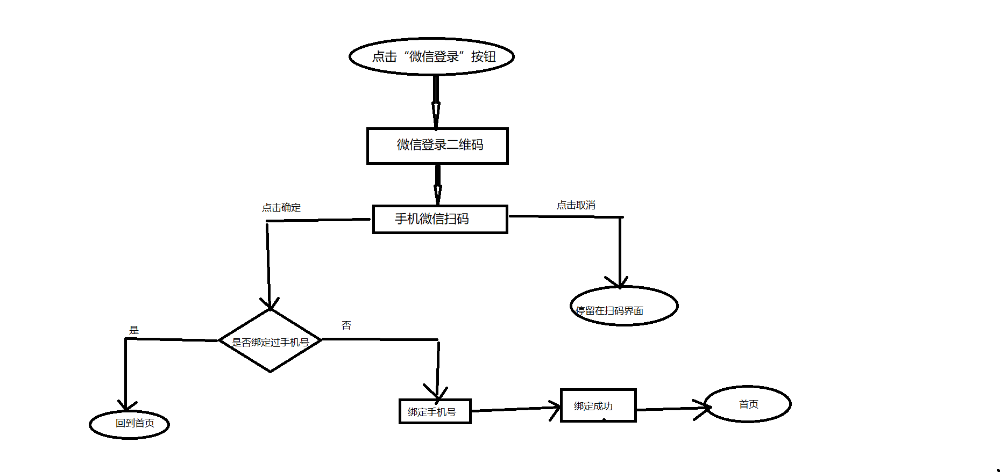
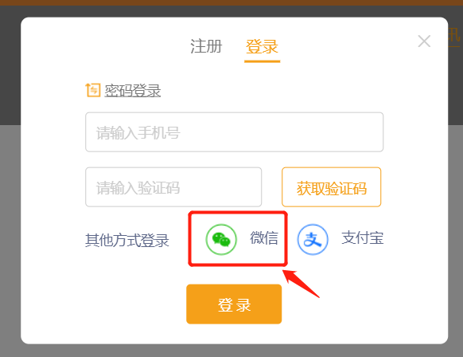
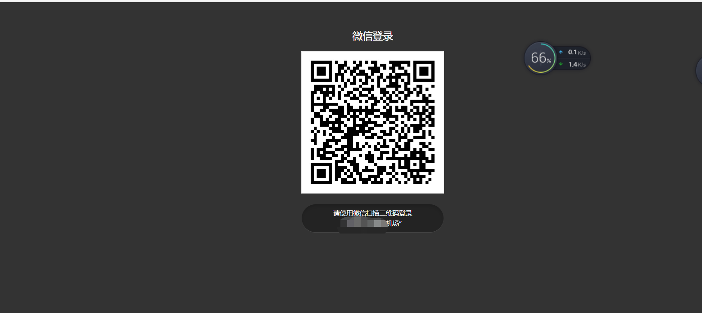
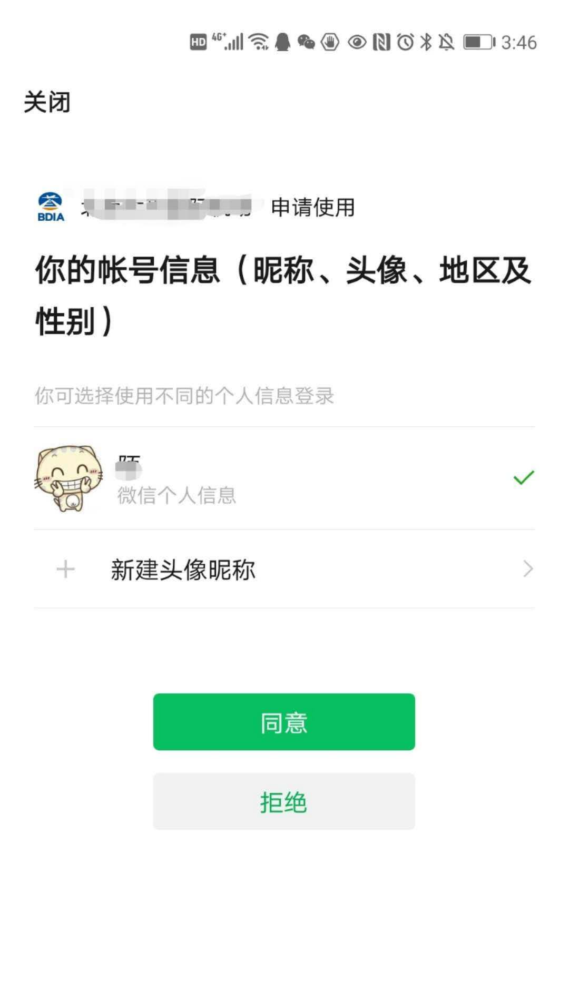
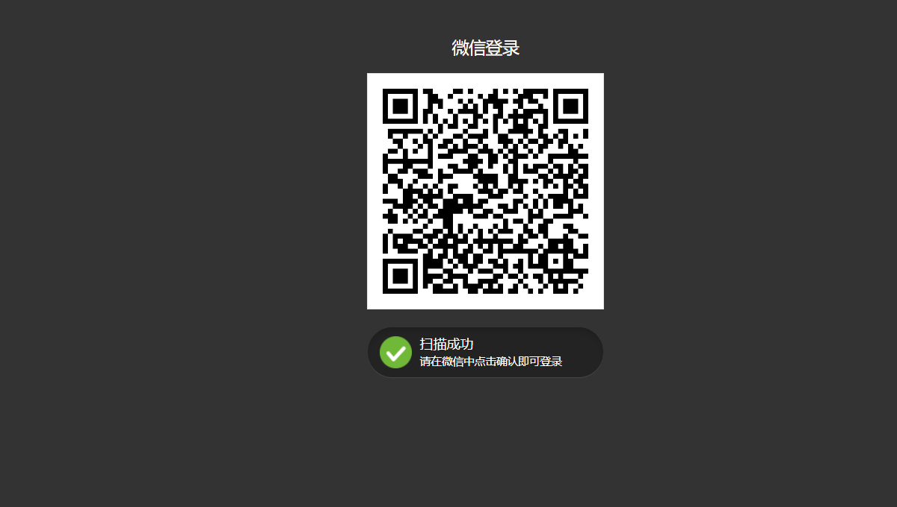

## pc端微信第三方登录+绑定手机号

流程图：
 

 效果图如下：
1、点击”微信登录“

 

生成微信登录的二维码：

```js
// 微信登陆
usewxlogin() { 
  let appId = 'xxxx'	//公众号平台提供的appId
  let redirectURI = 'xxxxx'	//扫码后回调地址
  window.location.href =
    'https://open.weixin.qq.com/connect/qrconnect?appid=' +
    appId +
    '&redirect_uri=' +
    redirectURI +
    '&response_type=code&scope=snsapi_login&state=STATE#wechat_redirect'
},
```
2、跳转到微信登录扫码页面

 


3、手机微信扫码授权

 

4、同意授权之后如下图所示：

 

5、同意授权之后跳转到第一步设置的扫码后回调地址，（我这里做了一个空白页页面）

 

 接受code，再把code传给后台获取用户相关信息

> 这里我和后台做的约定是，如果用户已经绑定过手机号，后台就给我返回用户信息，从而实现登录，如果用户没有绑定过手机号，则返回unionId，去绑定手机号，绑定成功之后，返回用户信息，具体实现过程如下

```js
 // 封装个公用方法，截取浏览器参数
//取地址栏的url
export function getUrlKey(name) {
    return (
        decodeURIComponent(
            (new RegExp("[?|&]" + name + "=" + "([^&;]+?)(&|#|;|$)").exec(
                location.href
            ) || [, ""])[1].replace(/\+/g, "%20")
        ) || null
    );
}

```

```js
//调用方法截取code
 let code = common.getUrlKey('code')
if (code) {
    //调用后台提供的接口 
    let that = this;
     weixinGoIndex(code).then(res => {
        if (res && res.code == 0) {
                if (res.data && res.data.status == 0) {
                        //  还没绑定过手机号,跳转绑定手机号页面
                        that.unionId = res.data.t;
                        if (that.unionId) {
                            that.$router.replace({
                                path: "/bindMobile",
                                query: {
                                    id: that.unionId
                                }
                            });
                        }
                    }
                    if (res.data && res.data.status == 200) {
                        //已经绑定过手机号，获取用户信息
                        let userData = res.data;
                        let { token, cid } = userData;
                        let name = userData.member.nickname;
                        let phone = userData.member.username;
                        let user = {
                            token: token,
                            cid: cid,
                            name: name,
                            phone: phone
                        };
                        that.$store.commit("CHANGE_LOGIN", user); //保存用户信息到本地
                        that.$store.commit("SHOW_USER", true); //显示用户头像
                         that.$router.replace({
                                path: "/home"
                          });
                    }    
        }
     })

}
},

```

跳转绑定手机号页面之后，获取unionId 调用绑定接口，绑定成功之后返回首页

```js
created() {
        let unionId = this.$route.query.id;
        if (unionId) {
            this.unionId = unionId;
        }
    },
   // 点击确定调用绑定接口
   ......
    

```
 