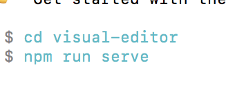

### 可视化编辑器

## 技术框架采用Vue3 + Typescript + ElementPlus

[预览地址](http://martsforever-pot.gitee.io/vue-visual-editor/)

实现效果如下：


### 创建工程

1、安装脚手架
全局安装过旧版本的 vue-cli(1.x 或 2.x)要先卸载它，否则跳过此步：


```bash
npm uninstall -g vue-cli
```
安装@vue/cli（Vue CLI 3的包名称由 vue-cli 改成了 @vue/cli）
```bash
 cnpm install -g @vue/cli //yarn global add @vue/cli
```

2、创建项目

```bash
vue create  visual-editor
```


发现创建的时候会报错  错误提示如下

```bash
ERROR  command failed: npm install --loglevel error --registry
```
> 
一、出现这个错误，首先需要排除，node，npm的版本问题。

二、然后尝试清除npm缓存：

npm cache clean --force

三、关键方法：使用这个方法解决，GitHub上大拿们给的方法：

解答1："useTaobaoRegistry"原先是false，将其设置为true。

解答2：文件，~/.vuerc的位置：


3、启动项目



问题：
1、vue cli 3.0 windows上下箭失效解决方案
vue create  visual-editor改为
```bash
winpty vue.cmd create  visual-editor
```
这时候将***vue create 项目名***这个指令改为 winpty vue.cmd create 项目名 即可。
或者：
选择git bash 的安装目录，找到Git/etc/bash.bashrc文件
文件末尾添加 ：
alias vue='winpty vue.cmd'
关闭所有git bash，在重新打开既可

2、Vue CLI 3 和旧版使用了相同的 vue 命令，所以 Vue CLI 2 (vue-cli) 被覆盖了。如果你仍然需要使用旧版本的 vue init 功能，你可以全局安装一个桥接工具：
```bash
npm install -g @vue/cli-init
```
//安装完后 就还可以使用 vue init 命令
```bash
vue init webpack my_project
vue --version
```


npm 遇到问题


https://blog.csdn.net/weixin_43336281/article/details/107064733

项目依赖安装：
```bash
cnpm i element-plus -S
```

项目错误提示：
```
  error  Unnecessary semicolon  no-extra-semi
```

如果希望 eslint 不检查分号这一项，在项目根目录下找到.eslintrc.js文件，为rules 属性新增配置：
'semi': 0


特别说明：
如果我们希望在每个 js 代码每一个表达式的结尾都以分号结尾，则在 rules 字段增加配置： ‘semi’: [“error”, “always”] ，否则 eslint 会给出错误提示。

### 功能列表

可视化编辑器实现的基本功能列表
- [ ] 主页面结构：左侧可选组件列表、中间容器画布、右侧编辑组件定义好的属性
- [ ] 从菜单拖拽组件到容器；
- [ ] Block的选中状态；
- [ ] 容器内的组件可以拖拽移动位置；
- [ ] 命令队列以及对应的快捷键；
- [ ] 单选、多选；
- [ ] 设计好操作栏按钮：
    - [ ] 撤销、重做；
    - [ ] 导入、导出；
    - [ ] 置顶、置底；
    - [ ] 删除、清空；
- [ ] 拖拽贴边；
- [ ] 组件可以设置预定义好的属性；
- [ ] 右键操作菜单；
- [ ] 拖拽调整宽高；
- [ ] 组件绑定值；
- [ ] 根据组件标识，通过作用域插槽自定义某个组件的行为
    - [ ] 输入框：双向绑定值、调整宽度；
    - [ ] 按钮：类型、文字、大小尺寸、拖拽调整宽高；
    - [ ] 图片：自定义图片地址，拖拽调整图片宽高；
    - [ ] 下拉框：预定义选项值，双向绑定字段；

### 一、页面布局
- 左侧菜单栏放置组件列表
- 中间是画布和工具栏，用来编辑预览页面
- 右侧是我们选中某个组件后，显示的该组件的属性


### 二、数据结构设计与双向绑定实现
**数据结构设计**
- 定义数据结构如下
  - container 表示画布容器
  - blocks 表示放置在容器中的组件
  - 每个block表示一个组件，包含了组件的类型位置、宽高、选中状态等信息
- 画布采用绝对定位，里面的元素通过top、left来确定位置
 ```json
{
      container: {
        width: 800,
        height: 500,
    },
    blocks: [
        {
            left: 100,
            top: 100,
            componentKey:'button',
        },
        {
            left: 200,
            top: 200,
            componentKey:'input'
        },
    ],
}

 ```
 **数据双向绑定实现**
 - 组件采用vue3中的jsx语法编写，需要实现数据双向绑定机制，useModel就是用来处理数据双向绑定的

```ts

import { computed, defineComponent, ref, watch } from "vue";

// 用jsx封装组件的时候，实现双向数据绑定
export function useModel<T>(getter: () => T, emitter: (val: T) => void) {
  const state = ref(getter()) as { value: T };

  watch(getter, (val) => {
    if (val !== state.value) {
      state.value = val;
    }
  });

  return {
    get value() {
      return state.value;
    },
    set value(val: T) {
      if (state.value !== val) {
        state.value = val;
        emitter(val);
      }
    },
  };
}

```
useModel用法

```ts
// modelValue 外部可以用v-model绑定
export const TestUseModel = defineComponent({
  props: {
    modelValue: { type: String },
  },
  emits: {
    "update:modelValue": (val?: string) => true,
  },
  setup(props, ctx) {
    const model = useModel(
      () => props.modelValue,
      (val) => ctx.emit("update:modelValue", val)
    );
    return () => (
      <div>
        自定义输入框
        <input type="text" v-model={model.value} />
      </div>
    );
  },
});
```
### 三、Block渲染
- 新建visual-editor-block的组件
- block来表示在画布显示的组件元素
- block先用文本来占位
```ts
import { computed, defineComponent, PropType } from "vue";
import { VisualEditorBlockData } from "./visual-editor.utils";

export const VisualEditorBlock = defineComponent({
  props: {
    block: {
      type: Object as PropType<VisualEditorBlockData>,
    },
  },
  setup(props) {
    const styles = computed(() => ({
      top: `${props.block?.top}px`,
      left: `${props.block?.left}px`,
    }));
    return () => (
      <div class="visual-editor-block" style={styles.value}>
        这是一条block
      </div>
    );
  },
});


```

- 将定义的数据用v-model传入editor

```ts
<template>
  <div class="app">
    <visual-editor v-model="editorData" />
  </div>
</template>

<script lang="ts">
import { defineComponent } from "vue";
import { VisualEditor } from "../src/packages/visual-editor";

export default defineComponent({
  name: "App",
  components: { VisualEditor },
  data() {
    return {
      editorData: {
        container: {
          height: 500,
          width: 800,
        },
        blocks: [
          { top: 100, left: 100 },
          { top: 200, left: 200 },
        ],
      },
    };
  },
});
</script>


```
- 引入block组件，并进行渲染

visual-editor.tsx文件

```ts
import { computed, defineComponent, PropType } from "vue";
import { useModel } from "./utils/useModel";
import { VisualEditorBlock } from "./visual-editor-block";
import "./visual-editor.scss";
import { VisualEditorModelValue } from "./visual-editor.utils";

export const VisualEditor = defineComponent({
  props: {
    modelValue: {
      type: Object as PropType<VisualEditorModelValue>,
    },
  },
  emits: {
    "update:modelValue": (val?: VisualEditorModelValue) => true,
  },

  setup(props, ctx) {
    const dataModel = useModel(
      () => props.modelValue,
      (val) => ctx.emit("update:modelValue", val)
    );
    const containerStyles = computed(() => ({
      width: `${props.modelValue?.container.width}px`,
      height: `${props.modelValue?.container.height}px`,
    }));

    return () => (
      <div class="visual-editor">
        <div class="menu">menu</div>
        <div class="head">head</div>
        <div class="operator">operator</div>
        <div class="body">
          <div class="content">
            <div class="container" style={containerStyles.value}>
              {(dataModel.value?.blocks || []).map((block, index: number) => (
                <VisualEditorBlock block={block} key={index} />
              ))}
            </div>
          </div>
        </div>
      </div>
    );
  },
});


```

### 四、左侧组件菜单

**安装Element-plus 组件库，并在项目中使用**

```bash
npm install element-plus -S
```

```
import ElementPlus from "element-plus";
import "element-plus/lib/theme-chalk/index.css";
const app = createApp(App);
app.use(ElementPlus);
app.mount("#app");

```
**配置信息**

在visual-editor.utils.ts中创建createVisualEditorConfig函数，用于创建编辑器配置

```ts
// 组件结构
export interface VisualEditorComponent {
  key: string;
  label: string;
  preview: () => JSX.Element;
  render: () => JSX.Element;
}

// 创建编辑器配置
export function createVisualEditorConfig() {
  const componentList: VisualEditorComponent[] = [];
  const componentMap: Record<string, VisualEditorComponent> = {};

  return {
    componentList,
    componentMap,
    registry: (key: string, component: Omit<VisualEditorComponent, "key">) => {
      const comp = { ...component, key };
      componentList.push(comp);
      componentMap[key] = comp;
    },
  };
}

// 配置类型
export type VisualEditorConfig = ReturnType<typeof createVisualEditorConfig>;

```
- 新建编辑器配置文件visual.config.tsx
- 创建配置，并在配置对象中注册文本、按钮、输入框三个组件
- 注册的组件对象放在componentList（用于渲染组件菜单）和componentMap(方便查找)里。
- label-组件名，preview-在组件菜单中显示的内容，render-组件拖拽到容器中显示的内容

```ts
import { createVisualEditorConfig } from '@/packages/visual-editor.utils'
import { ElButton, ElInput } from 'element-plus'
export const visualConfig = createVisualEditorConfig()
visualConfig.registry('text', {
    label: '文本',
    preview: () => '预览文本',
    render: () => '渲染文本',
})

visualConfig.registry('button', {
    label: '按钮',
    preview: () => <ElButton>按钮</ElButton>,
    render: () => <ElButton>渲染按钮</ElButton>,
})

visualConfig.registry('input', {
    label: '输入框',
    preview: () => <ElInput />,
    render: () => <ElInput />,
})

```
- 将配置导\传入visual-editor中，并进行组件菜单渲染
```ts
	<div class="menu">
          {props.config?.componentList.map((component) => (
            <div class="menu-item">
              <span class="menu-item-label">{component.label}</span>
              {component.preview()}
            </div>
          ))}
    </div>

```


### 五、组件拖拽到容器，并进行渲染

**菜单拖拽到容器**
- 给容器添加 containerRef
- 给左侧渲染的组件添加draggable属性（拖拽效果），并监听onDragstart、onDragend事件

```ts
<div class="visual-editor">
        <div class="menu">
          {props.config?.componentList.map((component) => (
            <div
              class="menu-item"
              draggable
              onDragend={menuDragger.dragend}
              onDragstart={(e) => menuDragger.dragstart(e, component)}
            >
              <span class="menu-item-label">{component.label}</span>
              {component.preview()}
            </div>
          ))}
        </div>
        <div class="head">head</div>
        <div class="operator">operator</div>
        <div class="body">
          <div class="content">
            <div
              class="container"
              ref={containerRef}
              style={containerStyles.value}
            >
              {(dataModel.value?.blocks || []).map((block, index: number) => (
                <VisualEditorBlock block={block} key={index} />
              ))}
            </div>
          </div>
        </div>
      </div>

```
- dataModel编辑器数据源，通过useModel方法来实现双向绑定
- containerRef画布容器的dom引用
- menuDragger鼠标拖拽事件监听
  - 当鼠标在组件按下时，触发组件的dragstart, 在dragstart中监听容器containerRef的dragenter dragover dragleave 和 drop事件
  - 当组件拖拽进容器时触发 dragenter事件，将鼠标状态dropEffect设置为move（可放置的效果）
  - 当组件拖拽离开容器时触发 dragleave事件，将鼠标状态dropEffect设置为none（不可放置的效果）
  - 当组件拖拽进画布并松开鼠标时，触发容器的drop事件和组件的dragend事件
  - 在drop事件中获取位置信息，并在数据源中添加新的block
  - 在dragend事件中移除容器监听的拖拽事件

```ts
    // 编辑器数据源
    const dataModel = useModel(
      () => props.modelValue,
      (val) => ctx.emit("update:modelValue", val)
    );
    const containerStyles = computed(() => ({
      width: `${props.modelValue?.container.width}px`,
      height: `${props.modelValue?.container.height}px`,
    }));

    const containerRef = ref({} as HTMLElement);

    const menuDragger = {
      current: {
        component: null as null | VisualEditorComponent,
      },
      dragstart: (e: DragEvent, component: VisualEditorComponent) => {
        containerRef.value.addEventListener("dragenter", menuDragger.dragenter);
        containerRef.value.addEventListener("dragover", menuDragger.dragover);
        containerRef.value.addEventListener("dragleave", menuDragger.dragleave);
        containerRef.value.addEventListener("drop", menuDragger.drop);
        menuDragger.current.component = component;
      },
      dragenter: (e: DragEvent) => {
        e.dataTransfer!.dropEffect = "move";
      },
      dragover: (e: DragEvent) => {
        e.preventDefault();
      },
      dragleave: (e: DragEvent) => {
        e.dataTransfer!.dropEffect = "none";
      },
      dragend: (e: DragEvent) => {
        containerRef.value.removeEventListener(
          "dragenter",
          menuDragger.dragenter
        );
        containerRef.value.removeEventListener(
          "dragover",
          menuDragger.dragover
        );
        containerRef.value.removeEventListener(
          "dragleave",
          menuDragger.dragleave
        );
        containerRef.value.removeEventListener("drop", menuDragger.drop);
        menuDragger.current.component = null;
      },
      drop: (e: DragEvent) => {
        console.log("drop", menuDragger.current.component);
        const blocks = dataModel.value?.blocks || [];
        blocks.push({
          top: e.offsetY,
          left: e.offsetX,
        });
        console.log("x", e.offsetX);
        console.log("y", e.offsetY);
        dataModel.value = {
          ...dataModel.value,
          blocks,
        } as VisualEditorModelValue;
      },
    };

```
**组件在容器内渲染**

- 将编辑器配置传入block中
- 根据block的 componentKey 属性在componentMap中查到注册的组件，调用render方法进行渲染

```ts
import { computed, defineComponent, PropType } from "vue";
import {
  VisualEditorBlockData,
  VisualEditorConfig,
} from "./visual-editor.utils";

export const VisualEditorBlock = defineComponent({
  props: {
    block: {
      type: Object as PropType<VisualEditorBlockData>,
    },
    config: {
      type: Object as PropType<VisualEditorConfig>,
    },
  },
  setup(props) {
    const styles = computed(() => ({
      top: `${props.block?.top}px`,
      left: `${props.block?.left}px`,
    }));

    return () => {
      const component = props.config?.componentMap[props.block!.componentKey];
      const Render = component?.render();
      return (
        <div class="visual-editor-block" style={styles.value}>
          {Render}
        </div>
      );
    };
  },
});


```
### 更新中。。。
**持续更新中。。。。。。**


