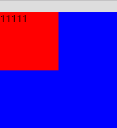
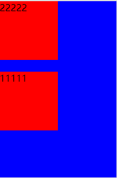

## margin折叠

（竖直方向的margin不叠加）

主要分为父子折叠以及兄弟折叠，都是垂直方向上的折叠

### （1）父子折叠（不一定是父子，可以是多层级的包含）:

 > 例如有两个div,父子嵌套，子div如果设置了margin-top:20px;父盒子会有margin-top:20px;而子div没有，这就是父子关系的margin垂直折叠    

 > 解决方法：变成bfc模式或将父元素与它的第一子元素「隔离开」

 -  1.在父层盒子添加：overflow：hidden (比较暴力，如果有悬浮窗可能导致无法看到)
 -  2.不用margin-top，改用padding-top （如果子盒子有border,那这个方法就不适合了）
 -  3.给父元素添加1px的padding或者添加一个style不为none的border，可以使用透明border（如果设计师不能容忍1px的差异，那这个就不适用了）
 -  4.给父元素加上浮动（如果要占满一行那就要加上width:100%）
 -   5.设置父元素dispaly:inline-block或者display:table-cell;（如果要占满一行那就要加上width:100%）
 -  6.给父元素添加绝对定位(不推荐)




 ```css
body{
    background:#ddd;
}
.parent-box{
    width: 200px;
    height:200px;
    /*border:1px solid #00f;*/
    background:#00f;
}
.child-box{
    width:100px;
    height:100px;
    margin-top:20px;
    background:#f00;
}
 ```

 ```html
<div class="parent-box">
    <div class="child-box">11111</div>
</div>
 ```

### （2）兄弟折叠
兄弟盒子：例如有两个div，一上一下，上div的margin-bottom:20px;下div的margin-top:20px;那么会出现的情况是中间只有20px；而不是40px;

解决方法:是给盒子浮动，或者加display:inline-block;

```css
<style>
body{
    background:#ddd;
}
.parent-box{
    width: 200px;
    height:300px;
    border:1px solid #00f;
    background:#00f;
}
.child-box2{
    width:100px;
    height:100px;
    margin-bottom:20px;
    background:#f00;
}
.child-box{
    width:100px;
    height:100px;
    margin-top:20px;
    background:#f00;
}
</style>

```

```html
<div class="parent-box">
    <div class="child-box2">22222</div>
    <div class="child-box">11111</div>
</div>

```

### 3、折叠的计算：
（1）参加折叠的margin都是正值：取其中 margin 较大的值为最终 margin 值。
（2）参与折叠的 margin 都是负值：取的是其中绝对值较大的，然后，从 0 位置，负向位移。
（3）参与折叠的 margin 中有正值，有负值：先取出负 margin 中绝对值中最大的，然后，和正 margin 值中最大的 margin 相加。

