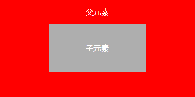

#### js中事件冒泡和事件捕获

### 什么是事件流？ 
事件流：从页面上接收事件的顺序。这个我们称之为事件流。

## 具体分为以下两种： 
 1.事件冒泡（IE的事件流） 

 2.事件捕获（Netscape Communicator提出的事件流）网景

事件冒泡：事件从事件目标（target）开始,往上冒泡直到页面的最上一级标签。

事件捕获：事件从最上一级标签开始往下查找，直到捕获到事件目标（target）;

### 1、冒泡事件：

> 事件按照从具体的元素开始触发，然后逐级向上传播到较为不具体的节点（document对象）（通俗来讲，就是当设定了多个div的嵌套时；即建立了父子关系，当父div与子div共同加了onclick事件时，当触发了子div的onclick事件后，子div进行相应的js操作，但是父div的onclick事件同样会被触发。）

（1）阻止事件冒泡：

 定义：阻止事件向上冒泡执行。

 方法：在目标元素的执行函数中加。

 ```js
e.stopPropagation()  //    chrome、Firefox等  
  e.cancelBubble = true;//  IE 
    封装的函数:
    obj 目标对象  evt事件
     //IE中的事件对象是一个隐式可用的全局对象：event，它是window对象的一个属性。
    　　//在标准DOM浏览器检测发生了某个事件时，将自动创建一个Event对象，并隐式地将该对象作为事件处理函数的一个参数传入
         //在ie浏览器中,window.event是全局变量,在非ie中，就需要自己传入一个参数来获取event啦，所以就有了var e = e||window.event
    function stopProp(evt){
         var e=evt||window.event;        //获取非IE或IE浏览器的事件
        if (window.event) { //如果是IE浏览器
            e.cancelBubble = true; //IE浏览器，设置该属性为true,取消事件冒泡
        }else{
            e.stopPropagation(); //非IE浏览器，该方法取消事件的进一步捕获或冒泡。
        }
    }
 ```

  使用情况：当想将目标元素的事件与其父元素的事件分开执行的时候，就需要对目标元素进行阻止冒泡。

  ### 实例：

#### （1）没阻止冒泡的情况：

   ```html
<style>
#parent1{
    width: 400px;
    height:200px;
    background-color: #f00;
    line-height:50px;
    text-align: center;
    color:#fff;
}
#child1{
    width: 200px;
    background-color: #aeaeae;
    height:100px;
    line-height:100px;
    margin:0 auto;
    text-align: center;
}
</style>
   <div id="parent1" onclick="fn(this);" >
        <div id="child1" onclick="fn1(this);">子元素</div>
    </div>
    <script>
        function fn(th){
            alert(th.id);
        }
        function fn1(th){
            alert(th.id);
        }
     </script> 


   ```

效果图：



 > 以上代码定义了两个div，一个父div,一个子div，点击每个div都会弹出一个消息框，显示其id。点击父div的时候只会弹出一个消息框显示parent1，但是点击子元素的时候先会弹出两个消息框，先是child1，接着弹出parent1；之所以会这样是因为点击child1事件会冒泡传导到其父元素parent1;

 #### （2）有阻止冒泡的情况：


```html

<div id="parent1" onclick="fn(this);" >
        <div id="child1" onclick="fn1(this);">子元素</div>
    </div>
    <script>
        function  stopPropagation(obj,ev){
             // alert(obj.id);
             var e=ev||window.event;
            //在ie浏览器中,window.event是全局变量,在非ie中，就需要自己传入一个参数来获取event啦，所以就有了var e = e||window.event
            if(window.event){
                e.cancelBuble=true;
             }else{
                e.stopPropagation();
             }
         }
        function fn(th){
            alert(th.id);
        }
        function fn1(th){
            alert(th.id);
            stopPropagation(th,event);
        }
     </script> 
```

 > 以上代码定义了两个div，一个父div,一个子div，点击每个div都会弹出一个消息框，显示其id。点击父div的时候只会弹出一个消息框显示parent1，点击子元素的时候也只会弹出一个消息框显示child1，不再弹出parent1；是因为点击child1时，使用cancelBubble属性或stopPropagation()方法来阻止冒泡；

### 2、捕获事件

 它和IE的事件冒泡刚好相反，事件从最不精确的对象(document对象)开始触发，然后逐级向下传播，直至目标元素

**w3c事件模型**

W3C模型是将两者进行中和，在W3C模型中，任何事件发生时，先从顶层开始进行事件捕获，直到事件触发到达了事件源元素。然后，再从事件源往上进行事件冒泡，直到到达document。

w3c事件模型的三个阶段：

- （1）捕捉（Capturing）阶段：事件将沿着DOM树向下传送，经过目标节点的每一个祖先节点，直至目标节点。例如，用户单击了一个超链接，则该单击事件将从document节点转送到html元素、body元素以及包含该链接的p元素。目标节点就是触发事件的DOM节点。

- （2）目标（target）阶段：在此阶段中，事件传导到目标节点。浏览器在查找到已经指定给目标事件的监听器后，就会运行该监听器。

- （3）冒泡（Bubbling）阶段：事件将沿着DOM树向上转送，再次逐个访问目标元素的祖先节点直到document节点。该过程中的每一步，浏览器都将检测那些不是捕捉事件监听器的事件监听器并执行它们。（即：与触发事件无关的事件监听器也由于冒泡将被执行）。


